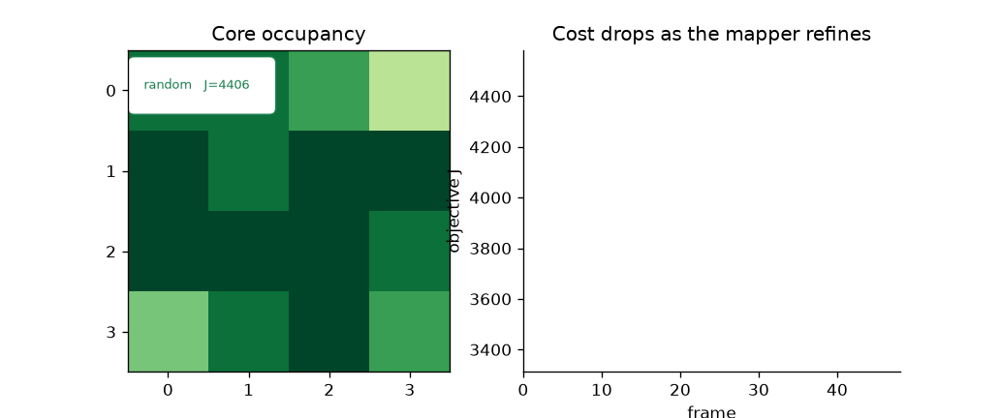
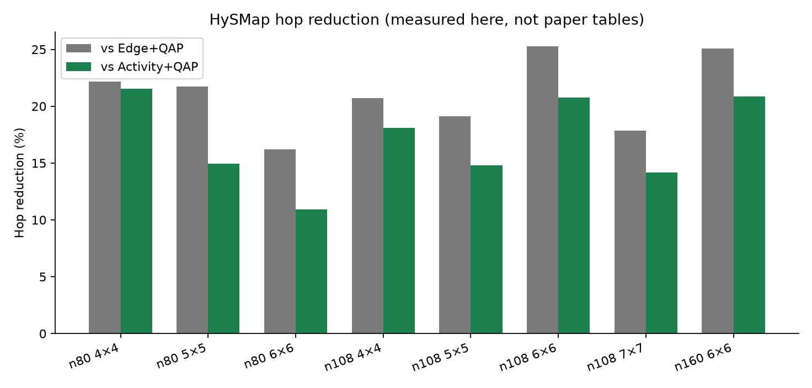
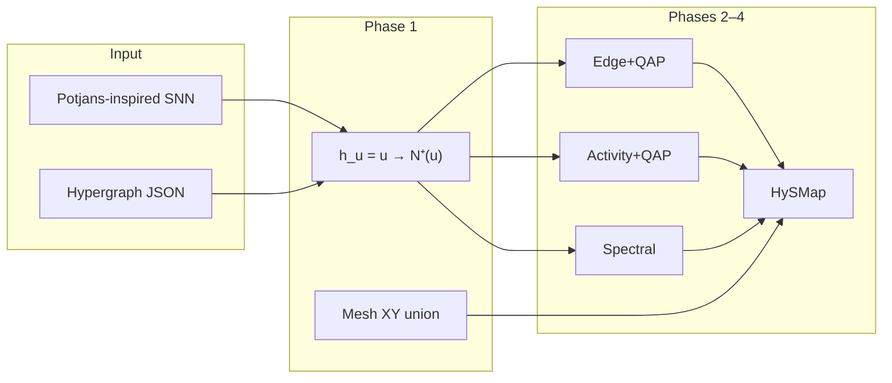

# HySMap

**Activity-weighted multicast hypergraph mapping for spiking neural networks on mesh NoCs.**

A spike is not a graph edge. It is one event delivered to a *set* of destinations, and the mesh routes that serve those destinations share links. This repo is a C++20 library + CLI (and optional Python module) that treat that object honestly.

Read it as a **six-phase curriculum**. Each phase is a module you can run, not a slide.

[](https://github.com/amineux/HySMap/actions/workflows/ci.yml)


Independent implementation **inspired by** [arXiv:2601.16118](https://arxiv.org/abs/2601.16118) and [arXiv:2608.26223](https://arxiv.org/abs/2608.26223). Not those papers’ code or tables. Every hop count below was measured by `./build/hysmap` in this repository.

<p align="center">
  
</p>

<p align="center"><em>Real mappings (random → greedy → Activity+QAP → HySMap-seeded) on the checked-in 80-neuron net, seed=1. Storyboard: <a href="docs/assets/storyboard.png">docs/assets/storyboard.png</a>. MP4: <a href="docs/assets/hysmap_demo.mp4">docs/assets/hysmap_demo.mp4</a>.</em></p>

---

## How to read this repo

| Phase | What you learn | Run this | Notes |
| :---: | --- | --- | --- |
| **1** | Tiny simulator: hypergraph, 4×4 XY mesh, cost | `hysmap demo --mesh 4 --neurons 80` | [docs/phases/01-tiny-simulator.md](docs/phases/01-tiny-simulator.md) |
| **2** | Partition + placement, random seed, greedy refine | `hysmap map --seed-strategy random --refine greedy` | [02-mapper.md](docs/phases/02-mapper.md) |
| **3** | Activity weights, spectral Laplacian, QAP seed | `hysmap map --mapper activity-qap` / `--seed-strategy spectral` | [03-intelligence.md](docs/phases/03-intelligence.md) |
| **4** | Incremental ΔJ, route cache, threads | `hysmap demo --threads 4 --mapper hysmap-seeded` | [04-performance.md](docs/phases/04-performance.md) |
| **5** | Baselines, suite, stats, plots | `hysmap compare` · `scripts/plot_results.py` | [05-research.md](docs/phases/05-research.md) |
| **6** | Tests, CLI, bindings, export, report | [technical-report.md](docs/technical-report.md) | [06-publication.md](docs/phases/06-publication.md) |


---

## Quickstart (C++)

```bash
cmake -B build -DCMAKE_BUILD_TYPE=Release -DCMAKE_CXX_COMPILER=g++
cmake --build build -j
ctest --test-dir build --output-on-failure

./build/hysmap demo --mesh 4 --neurons 80 --seed 1
./build/hysmap map --input examples/net_potjans_80.json --mesh 4 \
    --seed-strategy random --refine greedy --seed 1
./build/hysmap compare --input examples/net_potjans_80.json --mesh 4 --seed 1
./build/hysmap export --input examples/net_potjans_80.json --mesh 4 \
    --format loihi-json --out loihi.json
```

CMake ≥ 3.20, C++20 (GCC 13 on CI). Eigen and Catch2 come via FetchContent.

## Quickstart (Python)

```bash
cmake -B build -DHYSMAP_BUILD_PYTHON=ON -DHYSMAP_BUILD_TESTS=OFF -DCMAKE_CXX_COMPILER=g++
cmake --build build -j
PYTHONPATH=build python python/examples/quickstart.py

# or, with scikit-build-core + pybind11:
# pip install -e .
```

```python
import hysmap as hy
g = hy.generate_snn(hy.GeneratorConfig())
# set target_neurons / seed on the config as in python/examples/quickstart.py
```

## Loihi-style export

Research JSON: cores as neurocores, neurons as soma compartments, axon fanout, destination-core lists, mesh \((x,y)\). **Not** an official Intel NxSDK / Lava artifact.

```bash
./build/hysmap export --input examples/net_potjans_80.json --format loihi-json -o loihi.json
./build/hysmap export --input examples/net_potjans_80.json --format loihi-stub -o loihi.txt
```

---

## Measured results (this repo)

Mean ± s.d. routed multicast hops. Full table: [`results/SUMMARY.md`](results/SUMMARY.md). CSV: [`results/bench.csv`](results/bench.csv).

| Neurons | Mesh | Seeds | Edge+QAP | Activity+QAP | **HySMap** | vs Edge | vs Activity |
| ---: | :---: | ---: | ---: | ---: | ---: | ---: | ---: |
| 80 | 4×4 | 3 | 4552±251 | 4515±559 | **3543±258** | 22.2% | 21.5% |
| 80 | 5×5 | 3 | 5727±140 | 5270±43 | **4483±65** | 21.7% | 14.9% |
| 80 | 6×6 | 3 | 6354±178 | 5979±226 | **5325±61** | 16.2% | 10.9% |
| 108 | 4×4 | 3 | 6489±87 | 6280±226 | **5143±188** | 20.7% | 18.1% |
| 108 | 5×5 | 3 | 8683±388 | 8241±177 | **7022±303** | 19.1% | 14.8% |
| 108 | 6×6 | 3 | 10403±615 | 9811±340 | **7775±371** | 25.3% | 20.8% |
| 108 | 7×7 | 2 | 12022±352 | 11501±533 | **9873±750** | 17.9% | 14.2% |
| 160 | 6×6 | 1 | 17108 | 16199 | **12820** | 25.1% | 20.9% |

vs Edge+QAP **16.2–25.3%**. vs Activity+QAP **10.9–21.5%**. Traffic proxies, not joules.

<p align="center">
  
</p>

### Incremental + threads (Phase 4)

| | 80n / 4×4 | 108n / 6×6 |
| --- | ---: | ---: |
| Incremental vs full recompute | **2.66×** | **4.44×** |
| 4-thread candidate-gain batch | **1.66×** | **2.56×** |

Batches &lt; 32 stay serial (thread spawn would lose). Hop numbers are unchanged by threading: the same best move is committed.

Regenerate plots / GIF / MP4:

```bash
./scripts/make_demo.sh
```

---

## Why hypergraphs (and why this is not a GNN FPGA kernel)

Neuromorphic meshes waste energy on spike movement. Graph mappers count remote *synapses*. Hardware first collapses targets onto distinct cores and shares XY prefixes.

The same “irregular graph → spatial fabric” tax shows up in FPGA GNN kernels (AutoGNN-style hardware-kernel search, Vision-GNN accelerators). Those stacks still mostly optimize pairwise traffic. **The code in this repo is SNN → mesh NoC.** The abstraction — one event, many sinks, shared routes — is what those kernels will need when multicast is first-class.



---

## Library

```cpp
#include <hysmap/hysmap.hpp>
auto g = hysmap::generate_snn({.preset = hysmap::GeneratorPreset::Potjans,
                               .target_neurons = 108, .seed = 1});
hysmap::MeshNoC mesh(6, 6);
auto r = hysmap::run_mapper(g, mesh, {});
```

[`docs/architecture.md`](docs/architecture.md) · [`docs/algorithm.md`](docs/algorithm.md) · [`docs/technical-report.md`](docs/technical-report.md)

```
include/hysmap/   public headers          python/         pybind11 + examples
src/              library + CLI           scripts/        plots + demo
tests/            Catch2                  docs/phases/    1→6 curriculum
examples/         nets + recipes          results/        CSV, plots, GIF
```

---

## Citations (inspiration, not authorship)

1. Marco Ronzani and Cristina Silvano. *A Case for Hypergraphs…* [arXiv:2601.16118](https://arxiv.org/abs/2601.16118), 2026.
2. Amirreza Khorasanian. *Beyond Edge Cuts…* (M-HySMap) [arXiv:2608.26223](https://arxiv.org/abs/2608.26223), 2026.
3. T. C. Potjans and M. Diesmann. *Cerebral Cortex* 24:785–806, 2014.

---

## Roadmap

- [x] Phases 1–6 documentation spine
- [x] Incremental multicast + spectral + portfolio
- [x] Multithreading on large candidate batches
- [x] pybind11 module
- [x] Loihi-style research export
- [ ] NEST / Brian2 importers
- [ ] GUI / calibrated energy (only with a public model)

[MIT](LICENSE) · [CONTRIBUTING](CONTRIBUTING.md)
