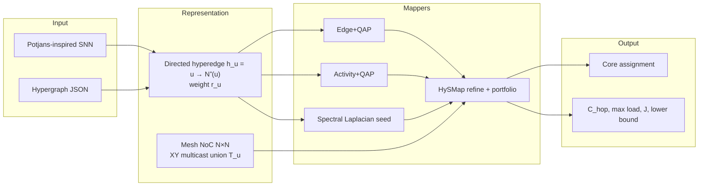

# HySMap

**Activity-weighted multicast hypergraph mapping for spiking neural networks on mesh NoCs.**

A spike is not a graph edge. It is one event delivered to a *set* of destinations, and the mesh routes that serve those destinations share links. HySMap is a C++20 library and CLI that treat that object honestly: a directed, activity-weighted hyperedge, a union of deterministic XY routes, and an exact incremental gain when you move one neuron.

This repository is an independent, original implementation **inspired by** two 2026 arXiv preprints. It does **not** claim those papers’ authorship, datasets, or tables. Every hop count and speedup in this README was measured by the `hysmap` binary in this repo.

[](https://github.com/amineux/HySMap/actions/workflows/ci.yml)


```
./build/hysmap demo --mesh 4 --neurons 80 --seed 1
# multicast hops   3557
# incremental      2.5× vs full recompute, |ΔJ| = 0
```

---

## Why a hiring manager (or a buyer) should care

Neuromorphic chips — Loihi-class meshes, TrueNorth-style cores, research NoCs — waste energy on **spike movement**. The industry-default toolchain still partitions a *graph* of synapses and places cores with pairwise distance (QAP). That counts the wrong thing:

| Graph mapper sees | Hardware actually does |
| --- | --- |
| 20 remote synapses from one axon | **1** multicast to the cores those 20 neurons occupy |
| \(\sum\) hops of independent packets | **Union** of XY paths (shared prefixes once) |
| Edge cut as quality | Same cut, different fanout, different congestion |

HySMap raises the model to a hypergraph and then **optimizes the routed union**, not just the cut. On our suite that is worth **16–25% fewer routed multicast hops** than Edge+QAP and **11–22%** fewer than a strong Activity+QAP seed — while a conservative lower bound and an exact incremental evaluator keep the search honest.

If you later productize this as a mapping SDK, the stable surfaces are already there: `DirectedHypergraph`, `MeshNoC`, `run_mapper()`, JSON in / JSON+CSV out.

### Why this matters beyond SNNs

The same “irregular graph → spatial fabric” tax shows up in FPGA GNN kernels (AutoGNN-style hardware-kernel search, Vision-GNN accelerators). Those stacks still mostly optimize pairwise traffic. HySMap’s code is specialized to **SNN → mesh NoC**, but the abstraction — one event, many sinks, shared routes — is the one those kernels will need when multicast and on-chip reuse become first-class.

---

## What it does



1. **Hypergraph** — one axon per source neuron, activity weight \(r_u\).
2. **Mesh** — capacity-constrained cores, deterministic X-then-Y routing, link congestion.
3. **Baselines** — Edge+QAP and Activity+QAP (pairwise flow × Manhattan, force polish).
4. **Spectral seed** — hypergraph Laplacian / Fiedler embedding discretized onto the mesh.
5. **HySMap refine** — FM-style moves under the multicast objective, using the locality theorem: moving \(v\) touches only \(\{v\}\cup N^-(v)\). Incremental \(\Delta\mathcal{J}\) matches a full recompute to \(10^{-9}\).
6. **Lower bound** — \(C_{\mathrm{hop}}\ge F_{\mathrm{remote}}=\sum_u r_u|D_u|\) for a fixed partition; documented assumptions in [`docs/algorithm.md`](docs/algorithm.md).

---

## Quickstart

```bash
cmake -B build -DCMAKE_BUILD_TYPE=Release
cmake --build build -j
ctest --test-dir build --output-on-failure

./build/hysmap demo --mesh 4 --neurons 80 --seed 1
./build/hysmap generate --preset potjans --neurons 108 --seed 1 --out net.json
./build/hysmap compare --input net.json --mesh 4 --seed 1 --csv out.csv
./build/hysmap map --input net.json --mesh 5 --mapper hysmap --json --out map.json
```

Requires CMake ≥ 3.20 and a C++20 compiler (GCC 13 is what CI uses). Eigen 3.4 and Catch2 v3 are pulled with FetchContent. No GPU, no Python, no MPI.

If your `/usr/bin/c++` is Clang without a findable `libstdc++`, configure with `-DCMAKE_CXX_COMPILER=g++`.

---

## CLI

| Command | Purpose |
| --- | --- |
| `hysmap generate` | Potjans / layered / ER hypergraph → JSON |
| `hysmap map` | One mapper, print metrics, optional JSON assignment |
| `hysmap compare` | Edge+QAP, Activity+QAP, Spectral, HySMap-seeded, HySMap |
| `hysmap bench` | Seeded suite (`--quick` or `--full`) |
| `hysmap demo` | Zero-file walkthrough with incremental timing |

Mappers: `edge-qap` · `activity-qap` · `spectral` · `hysmap-seeded` · `hysmap` (portfolio incumbent).

```bash
./build/hysmap map --input examples/net_potjans_80.json --mesh 4 \
    --mapper hysmap --time-incremental --seed 1
```

---

## Measured results (this repo)

Potjans-inspired layered E/I recurrent nets, deterministic seeds, same activity vector for every mapper. Full CSV: [`results/bench.csv`](results/bench.csv). Narrative: [`results/SUMMARY.md`](results/SUMMARY.md).

| Neurons | Mesh | Seeds | Edge+QAP | Activity+QAP | **HySMap** | vs Edge | vs Activity |
| ---: | :---: | ---: | ---: | ---: | ---: | ---: | ---: |
| 80 | 4×4 | 3 | 4552 | 4515 | **3543** | 22.2% | 21.5% |
| 80 | 5×5 | 3 | 5727 | 5270 | **4483** | 21.7% | 14.9% |
| 80 | 6×6 | 3 | 6354 | 5979 | **5325** | 16.2% | 10.9% |
| 108 | 4×4 | 3 | 6489 | 6280 | **5143** | 20.7% | 18.1% |
| 108 | 5×5 | 3 | 8683 | 8241 | **7022** | 19.1% | 14.8% |
| 108 | 6×6 | 3 | 10403 | 9811 | **7775** | 25.3% | 20.8% |
| 108 | 7×7 | 2 | 12022 | 11501 | **9873** | 17.9% | 14.2% |
| 160 | 6×6 | 1 | 17108 | 16199 | **12820** | 25.1% | 20.9% |

Values are mean routed multicast hops. HySMap vs Edge+QAP: **16.2–25.3%**. vs Activity+QAP: **10.9–21.5%**.

These are *mapping-level traffic proxies* (hops, max link load, load variance). We do not convert them into energy, latency, or joules without a calibrated chip model.

### Incremental evaluator

Moving neuron \(v\) invalidates only \(\mathcal{A}(v)=\{v\}\cup N^-(v)\). On the same candidate list:

| | |
| --- | --- |
| Speedup vs full recompute | **2.3–5.1×** (grows with \(n\) and mesh; 5.1× at 160 neurons / 6×6) |
| Average \(\|\mathcal{A}(v)\|\) | ~9–14 source hyperedges |
| Max \(\|\Delta\mathcal{J}\|\) vs full recompute | floating-point noise (Catch2 requires \(<10^{-9}\)) |

Reproduce: `./benchmarks/run_suite.sh results/bench.csv quick`

---

## Library API (SDK-shaped)

```cpp
#include <hysmap/hysmap.hpp>

auto g = hysmap::generate_snn({.preset = hysmap::GeneratorPreset::Potjans,
                               .target_neurons = 108, .seed = 1});
hysmap::MeshNoC mesh(6, 6);
hysmap::MapperConfig cfg;          // kind = HySMap, slack = 0.15
auto result = hysmap::run_mapper(g, mesh, cfg);
// result.metrics.hops, .max_load, .objective, .lower_bound
// result.mapping.physical_core(v)
```

| Module | Role |
| --- | --- |
| `include/hysmap/hypergraph.hpp` | Directed activity-weighted hypergraph |
| `mesh.hpp` | \(R\times C\) NoC, XY, multicast union |
| `cost.hpp` / `incremental.hpp` | \(\mathcal{J}\) and exact local gains |
| `partition.hpp` / `placement.hpp` | FM, QAP, force, min-distance, spectral |
| `mapper.hpp` | Named pipelines + portfolio |
| `io.hpp` | JSON networks, JSON/CSV metrics |

Details: [`docs/architecture.md`](docs/architecture.md) · math: [`docs/algorithm.md`](docs/algorithm.md).

---

## Project layout

```
include/hysmap/   public headers
src/              library + CLI
tests/            Catch2 (hypergraph, routing, incremental ≡ full, capacity)
examples/         configs + checked-in networks
docs/             algorithm + architecture
benchmarks/       run_suite.sh
results/          measured CSV + summary
.github/workflows/ci.yml
```

---

## Citations (inspiration, not authorship)

HySMap **reimplements ideas from** these works. Read them. Cite them. Do not cite this repo as if it were those papers.

1. Marco Ronzani and Cristina Silvano. *A Case for Hypergraphs to Model and Map SNNs on Neuromorphic Hardware.* [arXiv:2601.16118](https://arxiv.org/abs/2601.16118), 2026.  
   Hypergraph SNN model, synaptic reuse / hyperedge locality, spectral (Laplacian) placement.

2. Amirreza Khorasanian. *Beyond Edge Cuts: Activity-Weighted Multicast Hypergraph Mapping for Spiking Neural Networks on Mesh NoCs* (M-HySMap). [arXiv:2608.26223](https://arxiv.org/abs/2608.26223), 2026.  
   Route-union objective, congestion terms, affected-source locality, incremental gains, conservative lower bound, Edge+QAP / Activity+QAP ablation.

Related SNN / cortical structure (generator only):

- T. C. Potjans and M. Diesmann. *The Cell-Type Specific Cortical Microcircuit.* Cerebral Cortex 24:785–806, 2014.  
- W. Maass. *Networks of Spiking Neurons.* Neural Networks 10:1659–1671, 1997.

Classical machinery we reuse as **seeds**, not as the optimized object: Fiduccia–Mattheyses, Koopmans–Beckmann QAP, Zhou–Huang–Schölkopf hypergraph Laplacians.

---

## Roadmap (toward a mapping SDK)

- [x] C++20 library + CLI + Catch2 + CI
- [x] Incremental multicast refine + spectral seed + portfolio
- [ ] pybind11 bindings / Python notebook story
- [ ] Importers: NEST, Brian2, Loihi NxNet
- [ ] Pluggable routing (west-first, hardware multicast trees)
- [ ] GUI for partition/placement inspection
- [ ] Loihi / SpiNNaker export
- [ ] Calibrated energy backend (only with a public, citable cost model)

---

## License

[MIT](LICENSE). Contributions: [CONTRIBUTING.md](CONTRIBUTING.md).
