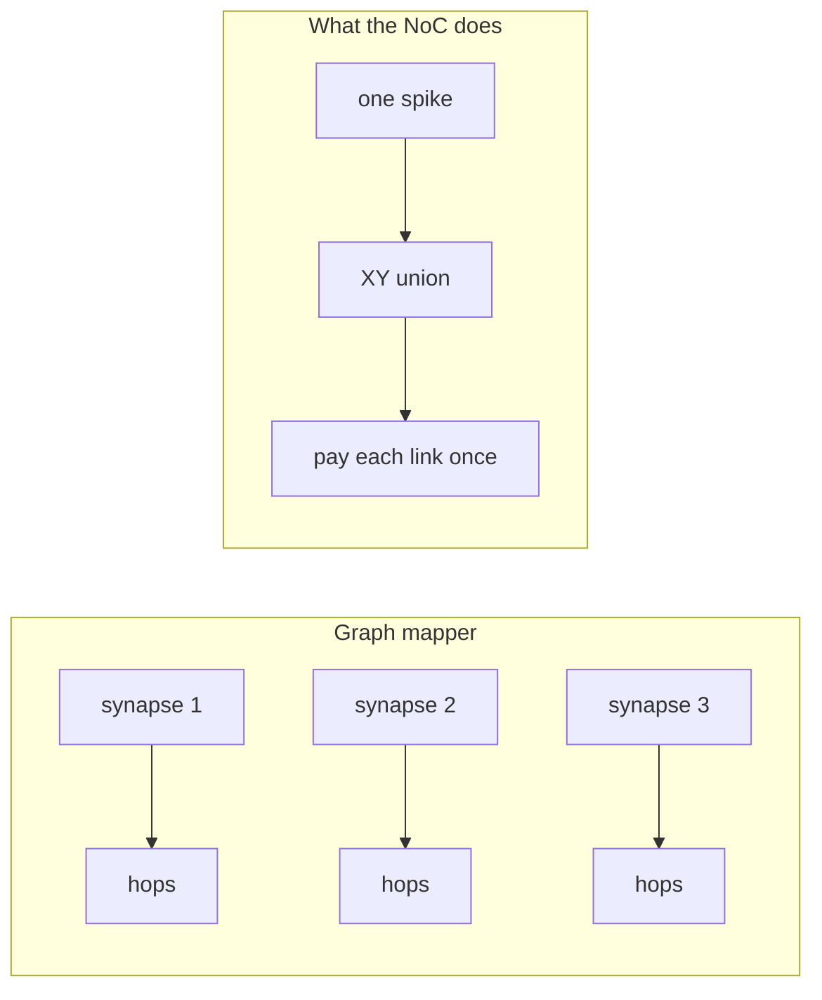
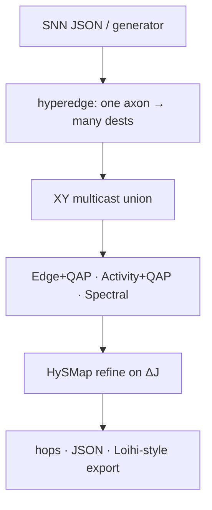

# HySMap

**A spike isn't an edge.** Map an SNN as a graph and you're billing the mesh twice for the same wire.

One axon event, a *set* of destinations, routes that share links. This is a small C++20 mapper (optional Python) that costs that object honestly — activity-weighted multicast on a mesh NoC.

[](https://github.com/amineux/HySMap/actions/workflows/ci.yml)


Inspired by [arXiv:2601.16118](https://arxiv.org/abs/2601.16118) and [arXiv:2608.26223](https://arxiv.org/abs/2608.26223). Not their code, not their tables. Hop counts below came out of `./build/hysmap` in this repo.

<p align="center">
  
</p>

<p align="center"><em>random placement → HySMap. Same 80-neuron net, same seed. <a href="docs/assets/storyboard.png">storyboard</a> · <a href="docs/assets/hysmap_demo.mp4">mp4</a></em></p>

```bash
# the 30-second wow: print hop reduction vs the graph baselines
cmake -B build -DCMAKE_BUILD_TYPE=Release && cmake --build build -j
./build/hysmap compare --input examples/net_potjans_80.json --mesh 4 --seed 1
```

On this binary that last line reads **HySMap hop reduction vs Edge+QAP: 23.3%   vs Activity+QAP: 16.1%**. Your laptop should match; it's seeded.

No compiler yet? The "aha" is also a 15-vs-5 toy you can run with stock Python:

```bash
python3 scripts/intuition.py
```

---

## 30-second intuition

One neuron `S` at the corner of a 4×4. It spikes to five others sitting on a spine. Graph mappers add the five Manhattan distances. The chip routes **one** XY multicast and shares the prefix.

```
S ──1──2──3
          │
          4
          │
          5
```

| How you count | Cost | What you pretended |
| --- | ---: | --- |
| Graph: sum of pairwise hops | **15** | five independent unicast trips |
| Hardware: unique links in the XY union | **5** | one spike, shared wires |

That's a **3× lie**. Put three of those dests on the *same* core and the graph still counts three synapses; the mesh sees one destination. Worked numbers: [`docs/examples/01-hyperedge-vs-edges.md`](docs/examples/01-hyperedge-vs-edges.md).



---

## Why chip people (or your resume) care

- Neuromorphic meshes spend energy **moving spikes**, not multiplying activations. A mapping that overcounts hops is a power fiction.
- The same "irregular graph on a grid" tax shows up in NoCs and spatial accelerators. Multicast is first-class here, not a footnote.
- It's a real C++20 library with a CLI delta, Catch2 tests that incremental ΔJ matches a full recompute, and measurements you can rerun. Not a PDF with a hidden MATLAB folder.

Star if you want mapping that matches how a mesh actually routes.

---

## How to read this repo

Six phases. Each one is a command, not a slide.

| # | In one line | Run | Read |
| :---: | --- | --- | --- |
| 1 | Tiny SNN + 4×4 + a cost | `hysmap demo --mesh 4 --neurons 80` | [phase 1](docs/phases/01-tiny-simulator.md) · [example](docs/examples/01-hyperedge-vs-edges.md) |
| 2 | Partition, then place | `hysmap map --seed-strategy random --refine greedy` | [phase 2](docs/phases/02-mapper.md) · [example](docs/examples/03-partition-then-place.md) |
| 3 | Rates + spectral + QAP | `hysmap map --mapper activity-qap` | [phase 3](docs/phases/03-intelligence.md) · [example](docs/examples/02-activity-weighting.md) |
| 4 | Incremental ΔJ + threads | `hysmap demo --threads 4 --mapper hysmap-seeded` | [phase 4](docs/phases/04-performance.md) · [example](docs/examples/04-incremental-delta.md) |
| 5 | Baselines, stats, plots | `hysmap compare` · `scripts/plot_results.py` | [phase 5](docs/phases/05-research.md) |
| 6 | Tests, export, report | [technical report](docs/technical-report.md) | [phase 6](docs/phases/06-publication.md) |

Cookbook (copy-paste): [`docs/examples/00-cookbook.md`](docs/examples/00-cookbook.md).



---

## Quickstart

```bash
cmake -B build -DCMAKE_BUILD_TYPE=Release
cmake --build build -j
ctest --test-dir build --output-on-failure

./build/hysmap demo --mesh 4 --neurons 80 --seed 1
```

CMake ≥ 3.20, C++20. Eigen and Catch2 arrive via FetchContent. If your `c++` is Clang without libstdc++, pass `-DCMAKE_CXX_COMPILER=g++`.

Python (optional):

```bash
cmake -B build -DHYSMAP_BUILD_PYTHON=ON -DHYSMAP_BUILD_TESTS=OFF
cmake --build build -j
PYTHONPATH=build python python/examples/quickstart.py
# or: pip install -e .
```

```python
import hysmap as hy
cfg = hy.GeneratorConfig()
cfg.target_neurons = 48
cfg.seed = 1
g = hy.generate_snn(cfg)
print(hy.run_mapper(g, hy.MeshNoC(4, 4), hy.MapperConfig()).metrics.hops)
```

---

## Results (this repo)

Mean ± s.d. routed multicast hops. Full table + CSV: [`results/SUMMARY.md`](results/SUMMARY.md).

| Neurons | Mesh | Edge+QAP | Activity+QAP | **HySMap** | vs Edge | vs Act. |
| ---: | :---: | ---: | ---: | ---: | ---: | ---: |
| 80 | 4×4 | 4552±251 | 4515±559 | **3543±258** | 22.2% | 21.5% |
| 108 | 6×6 | 10403±615 | 9811±340 | **7775±371** | 25.3% | 20.8% |
| 160 | 6×6 | 17108 | 16199 | **12820** | 25.1% | 20.9% |

Across the suite: **16–25%** vs Edge+QAP, **11–22%** vs Activity+QAP. Traffic proxies, not joules. Threading does not change hops.

<p align="center">
  
</p>

Incremental vs full recompute: **2.7×** (80n/4×4) to **4.4×** (108n/6×6). 4-thread gain batches: **1.7–2.6×** once the candidate list is ≥ 32.

---

## Export and bindings

Loihi-*style* research JSON: cores, soma compartments, axon fanout, dest-core lists, mesh `(x,y)`. **Not** official Intel NxSDK / Lava.

```bash
./build/hysmap export --input examples/net_potjans_80.json --format loihi-json -o loihi.json
```

C++ entry: `#include <hysmap/hysmap.hpp>` then `hysmap::run_mapper(g, mesh, {})`.

[`docs/architecture.md`](docs/architecture.md) · [`docs/algorithm.md`](docs/algorithm.md) · [`docs/technical-report.md`](docs/technical-report.md) · [`docs/examples/`](docs/examples/)

```
include/hysmap/   public headers        python/        pybind11
src/              library + CLI         scripts/       plots + intuition
tests/            Catch2                docs/phases/   1→6
examples/         nets                  docs/examples/ worked numbers
```

---

## Cite / license / roadmap

1. Ronzani & Silvano, [arXiv:2601.16118](https://arxiv.org/abs/2601.16118) — hypergraphs + spectral placement (inspiration).
2. Khorasanian, [arXiv:2608.26223](https://arxiv.org/abs/2608.26223) — activity-weighted multicast + incremental ΔJ (inspiration).
3. Potjans & Diesmann, *Cerebral Cortex* 24:785–806, 2014 — layered E/I sizes we scale down.

- [x] Phases 1–6, incremental multicast, threads, pybind11, Loihi-style export
- [ ] NEST / Brian2 importers
- [ ] Calibrated energy — only if a public model exists

[MIT](LICENSE) · [CONTRIBUTING](CONTRIBUTING.md)

`neuromorphic` · `spiking-neural-networks` · `hypergraph` · `noc` · `cpp20` · `mapping` · `loihi`
