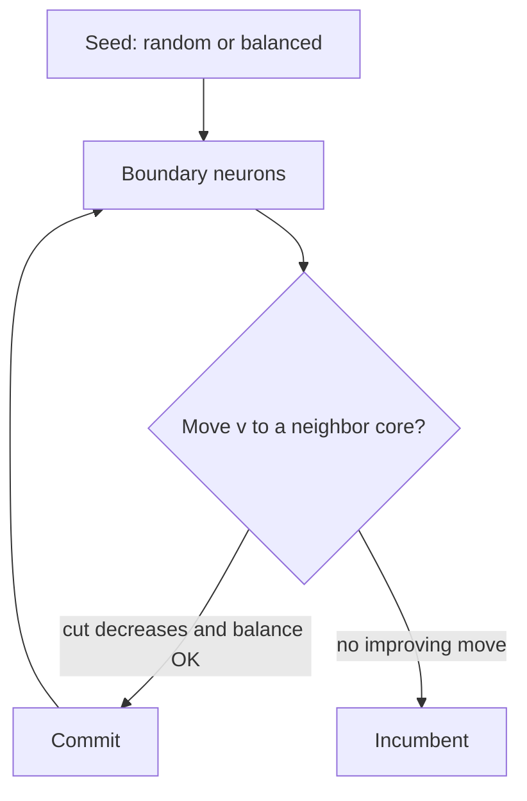

# Phase 2 — Mapper

Two questions: who shares a core, and where that core sits. Start random (or balanced), then greedily chip at the edge cut.

```bash
./build/hysmap map --input examples/net_potjans_80.json --mesh 4 \
    --seed-strategy random --refine greedy --seed 1
```

12 neurons, capacity 3, packed vs striped: [`docs/examples/03-partition-then-place.md`](../examples/03-partition-then-place.md).

| Flag | Values | Meaning |
| --- | --- | --- |
| `--seed-strategy` | `random` · `balanced` · `spectral` · `qap` | How \(p\) (and sometimes \(\pi\)) is initialized |
| `--refine` | `none` · `greedy` · `multicast` | Local search after the seed |

`--seed-strategy` / `--refine` override the named `--mapper` pipeline when set.

## Two discrete spaces

A mapping is \((p,\pi)\):

- \(p:V\to\{0,\ldots,k-1\}\) — which neurons share a core (capacity + 15% slack).
- \(\pi\) — where those cores sit on the mesh.

`random` draws a core per neuron and repairs overflows. `balanced` shuffles neurons and round-robins. `greedy` is FM-style boundary refinement on **edge cut** (Phase 2’s objective — still a graph cut).



## Why this is not the end

Greedy edge-cut can leave twenty remote synapses that all land on **one** destination core. Hardware sees one multicast. Phase 3 adds activity and spectral/QAP seeds; Phase 4 optimizes the routed union with incremental \(\Delta\mathcal{J}\).

## Code

- `assign_random` / `assign_balanced` — `src/partition.cpp`
- `refine_edge_cut` — greedy / FM-style
- `place_min_distance`, `place_force` — constructive / neighbor swaps

Next: [Phase 3 — Intelligence](03-intelligence.md).
